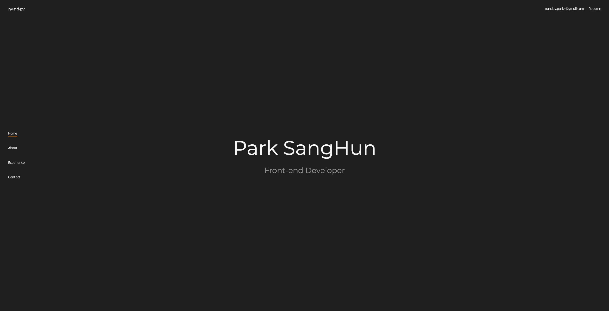

# 
nandev portfolio

 

#### 📄 개요

프론트엔드 개발자 박상훈의 포트폴리오입니다. 클라이언트는 Next.js를 사용했으며, 백엔드는 Node.js와 Express를 사용했습니다. 배포는 vercel과 AWS EC2를 이용해 배포했습니다.

 

#### 🛠 사용 기술

 

#### 🗓 개발 기간

2022.11 ~ 2022.12
